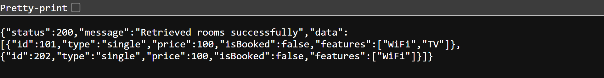

#RESTful API Activity - [Alexis Echon]
## Best Practices Implementation
**1. Environment Variables:**
- Why did we put BASE_URI in .env instead of hardcoding it?

Answer: using .env config values for BASE_URI allows flexibility across environments and secures sensitive values

**2. Resource Modeling**
- Why did we use plural nouns for our routes?

Answer: using plural nouns complies with RESTful conventions

**3. Status Codes**
- When do we use `201 Created` vs `200 OK`?

Answer: `201 Created` is used only when a new resource is created such as after a POST request, `200 OK` is used
when a request succeeds and returns data

- Why is it important to return `404` instead of just an empty array or a generic error?

Answer: this error clearly communicates that the requested resource does not exist

**4. Testing**
- 