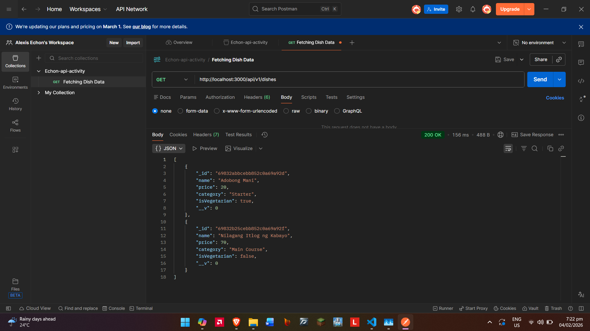
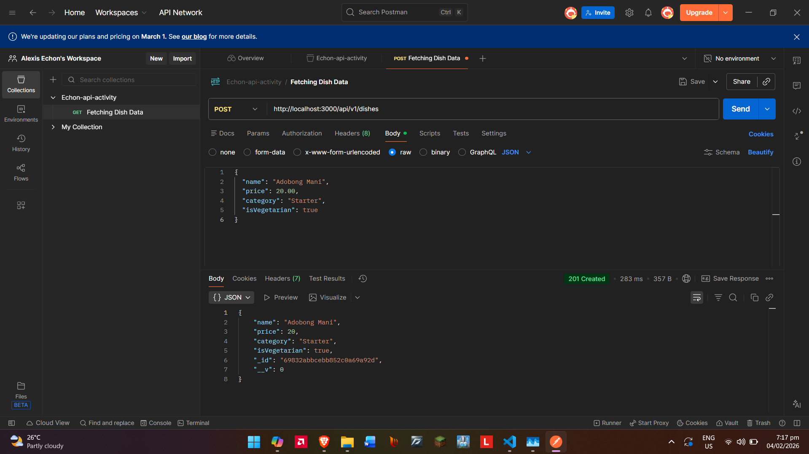
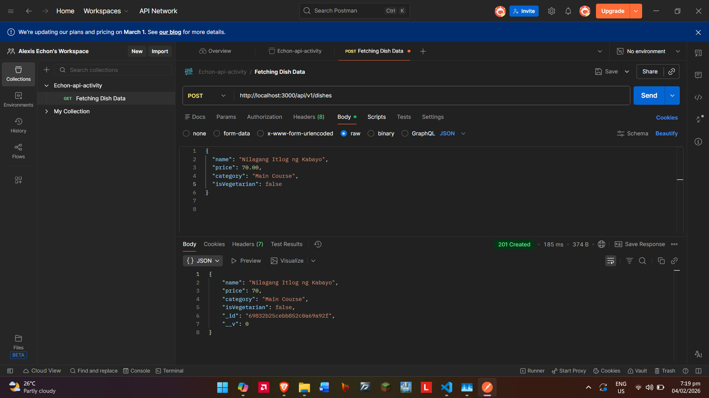

#RESTful API Activity - [Alexis Echon]
## Best Practices Implementation
**1. Environment Variables:**
- Why did we put BASE_URI in .env instead of hardcoding it?

Answer: using .env config values for BASE_URI allows flexibility across environments and secures sensitive values
unlike hardcoding it

**2. Resource Modeling**
- Why did we use plural nouns for our routes?

Answer: using plural nouns complies with RESTful conventions

**3. Status Codes**
- When do we use `201 Created` vs `200 OK`?

Answer: `201 Created` is used only when a new resource is created such as after a POST request, `200 OK` is used
when a request succeeds and returns data

- Why is it important to return `404` instead of just an empty array or a generic error?

Answer: it is important to show the error code as this error clearly communicates that the requested resource does not exist where no
error indicators and lack of conext lead to inaccuracies

**4. Testing**
- 

## Second Activity Practice
**1. GET Method 1**
- 

**2. POST Methods 1 & 2**
- 
- 

## 3. 3rd Activity

**1. "Why did I choose to Embed the [Review/Tag/Log]?"**
answer: Reviews are embeddded as they are connected to the main record and don't need to exist separately.

**2. "Why did I choose to Reference the [Chef/User/Guest]?"**
answer: Because chefs are independent entities that can be reused across many records. 
