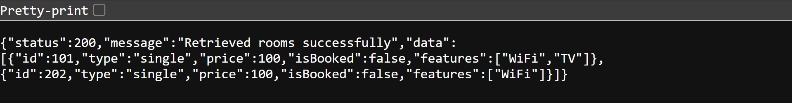

#RESTful API Activity - [Alexis Echon]
## Best Practices Implementation
**1. Environment Variables:**
- Why did we put BASE_URI in .env instead of hardcoding it?

Answer: using .env config values for BASE_URI allows flexibility across environments and secures sensitive values
unlike hardcoding it

**2. Resource Modeling**
- Why did we use plural nouns for our routes?

Answer: using plural nouns complies with RESTful conventions

**3. Status Codes**
- When do we use `201 Created` vs `200 OK`?

Answer: `201 Created` is used only when a new resource is created such as after a POST request, `200 OK` is used
when a request succeeds and returns data

- Why is it important to return `404` instead of just an empty array or a generic error?

Answer: it is important to show the error code as this error clearly communicates that the requested resource does not exist where no
error indicators and lack of conext lead to inaccuracies

**4. Testing**
- 

## Second Activity Practice
**1. GET Method 1**
- 

**2. POST Methods 1 & 2**
- 
- 

## Securing the API

1. [/] Code runs via npm run dev with no errors.
2. [/] Registration and Login endpoints are functional.
3. [/] Middleware correctly blocks unauthorized users.
4. [/] GitHub Repo link submitted.
5. [/] README.md updated with the following answers:

**1. Authentication vs Authorization**

What is the difference between Authentication and Authorization?

Answer: Authentication is a process of verifying the user's identity, Authorization
determines what a user can access depending on their role (RBAC)

**2. Security (Bcrypt)**

Why did we use bcryptjs instead of saving passwords as plain text in
MongoDB?

Answer: Bcryptjs converts them into hashes that are irreversible, salting adds unique hashes to each passwords even to those that are identical 

**3. JWT Structure**

What does the protect middleware do when it receives a JWT from the
client?

Answer: a) The protect middleware as a barrier or bouncer by extracting the JWT from the token header, (b) Verification: uses the JWT_SECRET to ensure the token is authentic and has not yet expired, c) Identification: by decoding the user ID from the taken payload, (d) Attachment: Finds the user in MongoDB and attaches their data to req.user, allowing the next function to know exactly who is making the request.

